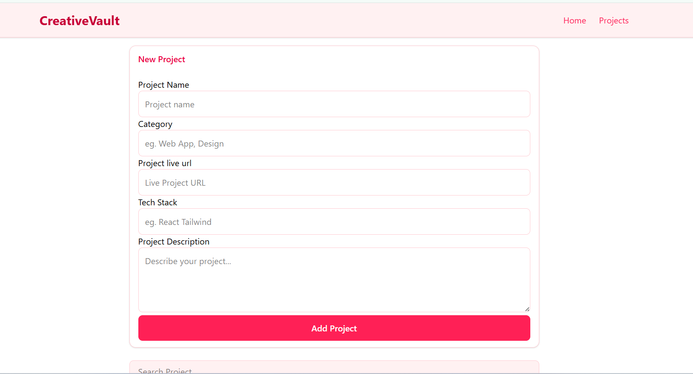

# CreativeVault

CreativeVault is a single-page application built with React that allows users to create, view, search, and manage a collection of projects dynamically. It demonstrates core frontend concepts including state management, component architecture, and form handling.

## Preview

## Live Demo

Live Site: [(https://creative-vault-project-showcase.vercel.app/)  
Repository:(https://github.com/carolkithinji35-ai/Creative-Vault-projects-showcase)

## Features

- Display a list of projects on the landing page  
- Add new projects dynamically through a form  
- Delete projects from the list  
- Persist project data using localStorage  
- Responsive layout for different screen sizes  

## Tech Stack

React, JavaScript (ES6+), Tailwind CSS, localStorage API

## Project Structure

src/  
components/ 
Header.jsx 
ProjectForm.jsx 
ProjectList.jsx
ProjectCard.jsx  
App.jsx  
main.jsx

## How It Works

1. Application loads projects from state or localStorage  
2. User adds project via controlled form  
3. Form updates state using React hooks  
4. New project is added to projects array on submit  
5. Projects render dynamically as cards  
6. Projects can be deleted and state updates instantly  
7. Data persists using localStorage  

## Installation

git clone (https://github.com/carolkithinji35-ai/Creative-Vault-projects-showcase)  
cd creativevault  
npm install  
npm run dev  

## Future Improvements

- Search and filter by category  
- Edit/update project functionality  
- UI animations and transitions  
- Backend integration with database  
- Authentication system  

## Author

Name: Caroline Kithinji    
Role: Frontend Developer (Learning Project)
